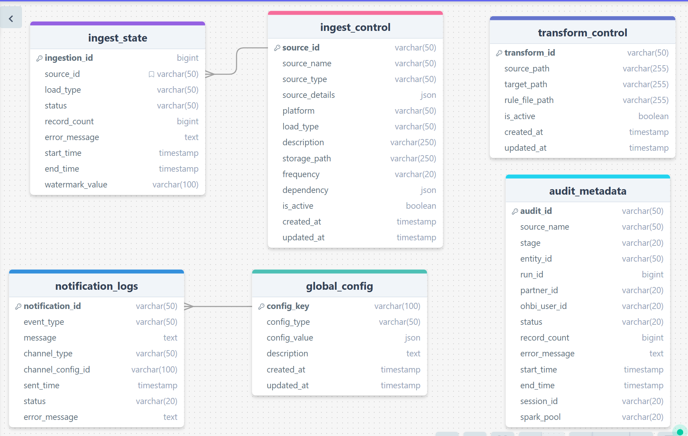
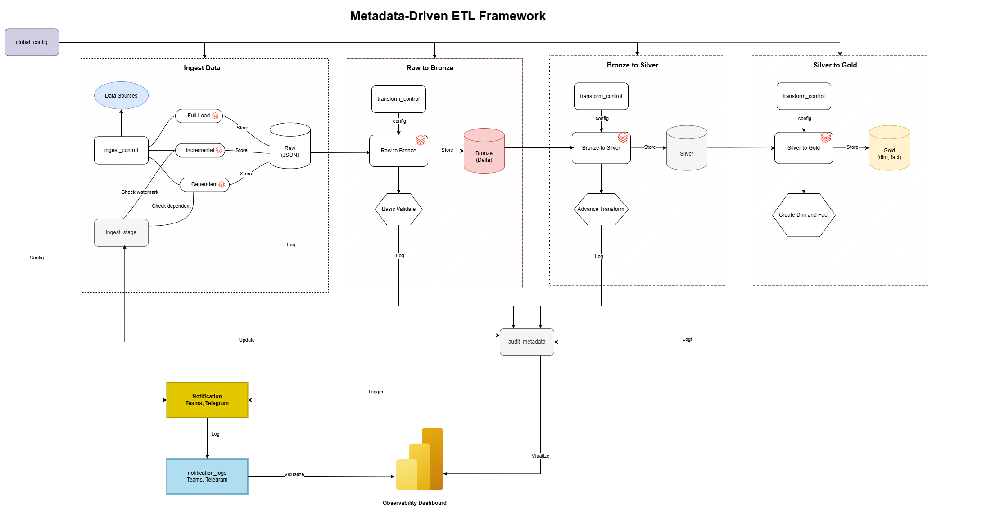

# Metadata-Driven Data Pipeline Documentation

## 1. Tổng quan dự án

Dự án này xây dựng một **metadata-driven data pipeline** để xử lý dữ liệu từ các nguồn khác nhau (**API**, **Database**, **File**) và đưa vào một **Data Warehouse** theo mô hình phân tầng (**Raw**, **Bronze**, **Silver**, **Gold**). Pipeline được thiết kế để:

- Hỗ trợ ba kiểu load (**Full**, **Incremental**, **Dependent**) ở tất cả """các""" giai đoạn.
- Tích hợp với **Microsoft Fabric** hoặc các hệ thống hỗ trợ **Delta Lake**.
- Gửi thông báo qua **Telegram** và **Microsoft Teams**.
- """Quản lý dữ liệu nhạy cảm (PII) với **Microsoft Purview**."""
- Cung cấp khả năng audit và observability thông qua dashboard.

### 1.1. Mục tiêu

- **Tự động hóa**: Sử dụng metadata để điều khiển pipeline mà không cần mã hóa cứng logic.
- **Linh hoạt**: Hỗ trợ đa nguồn dữ liệu và các kiểu load khác nhau.
- **Bảo mật**: Xử lý PII và lưu trữ thông tin xác thực an toàn qua **Azure Key Vault**.
- **Observability**: Ghi audit và thông báo để theo dõi trạng thái pipeline.

---

## 2. Kiến trúc hệ thống

Pipeline được chia thành các tầng dữ liệu sau:

1. **Data Source**: Dữ liệu đầu vào từ **API**, **Database**, **File**.
2. **Raw Layer**: Lưu dữ liệu gốc dưới dạng file JSON.
3. **Bronze Layer**: Chuyển đổi dữ liệu JSON thành Delta format, làm sạch cơ bản.
4. **Silver Layer**: Làm giàu dữ liệu, xử lý PII, lưu dưới dạng Delta table.
5. **Gold Layer**: Tạo Data Warehouse với bảng Dimension và Fact, tối ưu cho phân tích.

### 2.1. Các thành phần chính

- **Bảng điều khiển**:
  - `ingest_control`: Điều khiển Ingestion vào Raw Layer (bảng cứng, không chứa cột thời gian).
  - `ingest_state`: Theo dõi trạng thái động của Ingestion.
  - `transform_control`: Điều khiển các giai đoạn Bronze, Silver, Gold.
  - `global_config`: Lưu cấu hình chung (thông báo, xác thực API, lưu trữ).
  - `notification_logs`: Lưu lịch sử thông báo (Teams, Telegram).
  - `audit_metadata`: Ghi audit cho tất cả các giai đoạn.
- **Công cụ**:
  - **Spark/Delta Lake**: Xử lý dữ liệu lớn.
  - **Microsoft Fabric**: Môi trường triển khai (hỗ trợ Lakehouse, Delta Lake).
  - **Azure Key Vault**: Lưu trữ thông tin xác thực (token, access_id).

---

## 3. Cấu trúc các bảng

Dựa trên hình ảnh, dưới đây là cấu trúc và giải thích chi tiết của các bảng metadata, với các cột định dạng JSON được làm rõ và ví dụ cụ thể.

<p align="center">
  
</p>

### 3.1. Bảng `ingest_control`

- **Mục đích**: Điều khiển quá trình thu thập dữ liệu từ nguồn và lưu vào Raw Layer. Đây là bảng cứng, không chứa cột thời gian.
- **Cấu trúc**:
  ```sql
  CREATE TABLE ingest_control (
      source_id VARCHAR(50) PRIMARY KEY,
      source_name VARCHAR(50) NOT NULL,
      source_type VARCHAR(50) NOT NULL CHECK (source_type IN ('API', 'Database', 'File')),
      source_details JSON NOT NULL,
      platform VARCHAR(50),
      load_type VARCHAR(20) NOT NULL CHECK (load_type IN ('Full', 'Incremental', 'Dependent')),
      description VARCHAR(250),
      storage_path VARCHAR(250) NOT NULL,
      frequency VARCHAR(20) NOT NULL CHECK (frequency IN ('hourly', 'daily', 'on-demand')),
      dependency JSON,
      is_active BOOLEAN NOT NULL DEFAULT TRUE,
      created_at TIMESTAMP,
      updated_at TIMESTAMP
  );
  ```
- **Giải thích các cột**:
  - `source_id`: ID duy nhất của nguồn dữ liệu (ví dụ: `sales_api`).
  - `source_name`: Tên nguồn dữ liệu (ví dụ: `Sales API`).
  - `source_type`: Loại nguồn (`API`, `Database`, `File`).
  - `source_details`: Thông tin cấu hình nguồn dưới dạng JSON, bao gồm endpoint, thông tin xác thực, hoặc thông tin kết nối database.
  - `platform`: Nền tảng nguồn (ví dụ: `Shopee`, `Kiotviet`).
  - `load_type`: Kiểu load (`Full`, `Incremental`, `Dependent`).
  - `description`: Mô tả nguồn dữ liệu.
  - `storage_path`: Đường dẫn lưu trữ dữ liệu trong Raw Layer (ví dụ: `/raw/sales`).
  - `frequency`: Tần suất load dữ liệu (`hourly`, `daily`, `on-demand`).
  - `dependency`: Danh sách nguồn phụ thuộc dưới dạng JSON (dùng cho `Dependent` load).
  - `is_active`: Trạng thái kích hoạt của nguồn (TRUE/FALSE).
  - `created_at`, `updated_at`: Thời gian tạo và cập nhật bản ghi.
- **Ví dụ dữ liệu**:
  ```sql
  INSERT INTO ingest_control
  (source_id, source_name, source_type, source_details, platform, load_type, description, storage_path, frequency, dependency, is_active, created_at, updated_at)
  VALUES
  ('sales_api', 'Sales API', 'API', '{"endpoint": "https://api.sales.com", "auth": {"token": "keyvault://sales_api_token", "access_id": "12345", "shop_id": "shop_001"}}', 'Shopee', 'Incremental', 'API for sales data', '/raw/sales', 'hourly', '{"depends_on": []}', TRUE, '2025-04-18 09:00:00', '2025-04-18 09:00:00'),
  ('customer_db', 'Customer Database', 'Database', '{"server": "sql-server.database.windows.net", "db_name": "customer", "table": "customers", "auth": {"username": "admin", "password": "keyvault://db_password"}}', 'Shopee', 'Full', 'Customer data from SQL Server', '/raw/db', 'daily', '{"depends_on": []}', TRUE, '2025-04-18 09:00:00', '2025-04-18 09:00:00'),
  ('report_file', 'Report Files', 'File', '{"path": "s3://reports/", "format": "csv"}', 'Kiotviet', 'Dependent', 'Aggregated reports', '/raw/reports', 'daily', '{"depends_on": ["sales_api", "customer_db"]}', TRUE, '2025-04-18 09:00:00', '2025-04-18 09:00:00');
  ```
- **Giải thích cột JSON**:
  - `source_details`:
    - Đối với `sales_api`: Chứa thông tin API endpoint và thông tin xác thực.
    - Đối với `customer_db`: Chứa thông tin kết nối database (server, tên database, bảng, thông tin xác thực).
    - Đối với `report_file`: Chứa đường dẫn và định dạng file.
  - `dependency`:
    - Đối với `report_file`: Chỉ định rằng nguồn này phụ thuộc vào `sales_api` và `customer_db`, nghĩa là chỉ load sau khi hai nguồn kia hoàn thành.

### 3.2. Bảng `ingest_state`

- **Mục đích**: Theo dõi trạng thái động của các phiên load vào Raw Layer.
- **Cấu trúc**:
  ```sql
  CREATE TABLE ingest_state (
      ingestion_id VARCHAR(50) PRIMARY KEY,
      source_id VARCHAR(50) NOT NULL,
      load_type VARCHAR(20) NOT NULL CHECK (load_type IN ('Full', 'Incremental', 'Dependent')),
      status VARCHAR(20) NOT NULL CHECK (status IN ('Success', 'Failed', 'Running')),
      record_count BIGINT,
      error_message TEXT,
      start_time TIMESTAMP NOT NULL,
      end_time TIMESTAMP,
      watermark_value VARCHAR(100),
      FOREIGN KEY (source_id) REFERENCES ingest_control(source_id)
  );
  ```
- **Giải thích các cột**:
  - `ingestion_id`: ID duy nhất của mỗi phiên load (ví dụ: `ingest_sales_20250418_001`).
  - `source_id`: Tham chiếu đến `ingest_control` (ví dụ: `sales_api`).
  - `load_type`: Kiểu load (`Full`, `Incremental`, `Dependent`).
  - `status`: Trạng thái phiên load (`Success`, `Failed`, `Running`).
  - `record_count`: Số lượng bản ghi đã load.
  - `error_message`: Thông tin lỗi nếu load thất bại.
  - `start_time`, `end_time`: Thời gian bắt đầu và kết thúc phiên load.
  - `watermark_value`: Giá trị watermark cho `Incremental` load (ví dụ: thời gian gần nhất đã load).
- **Ví dụ dữ liệu**:
  ```sql
  INSERT INTO ingest_state
  (ingestion_id, source_id, load_type, status, record_count, error_message, start_time, end_time, watermark_value)
  VALUES
  ('ingest_sales_20250418_001', 'sales_api', 'Incremental', 'Success', 1000, NULL, '2025-04-18 10:00:00', '2025-04-18 10:05:00', '2025-04-18 10:00:00'),
  ('ingest_customer_20250418_001', 'customer_db', 'Full', 'Success', 5000, NULL, '2025-04-18 10:10:00', '2025-04-18 10:15:00', NULL),
  ('ingest_report_20250418_001', 'report_file', 'Dependent', 'Failed', 0, 'Dependency not met', '2025-04-18 10:20:00', '2025-04-18 10:21:00', NULL);
  ```

### 3.3. Bảng `transform_control`

- **Mục đích**: Điều khiển các giai đoạn xử lý (Bronze, Silver, Gold) với ba kiểu load.
- **Cấu trúc**:
  ```sql
  CREATE TABLE transform_control (
      transform_id VARCHAR(50) PRIMARY KEY,
      source_path VARCHAR(255) NOT NULL,
      target_path VARCHAR(255) NOT NULL,
      rule_file_path VARCHAR(255) NOT NULL,
      is_active BOOLEAN NOT NULL DEFAULT TRUE,
      created_at TIMESTAMP,
      updated_at TIMESTAMP
  );
  ```
- **Giải thích các cột**:
  - `transform_id`: ID duy nhất của quy trình xử lý (ví dụ: `raw_to_bronze_sales`).
  - `source_path`: Đường dẫn dữ liệu đầu vào (Raw Layer cho Bronze, Bronze Layer cho Silver, Silver Layer cho Gold).
  - `target_path`: Đường dẫn lưu trữ đầu ra (Bronze, Silver, hoặc Gold Layer).
  - `rule_file_path`: Đường dẫn đến file chứa quy tắc xử lý (schema mapping, validation rules, transformations).
  - `is_active`: Trạng thái kích hoạt của quy trình (TRUE/FALSE).
  - `created_at`, `updated_at`: Thời gian tạo và cập nhật bản ghi.
- **Ví dụ dữ liệu**:
  ```sql
  INSERT INTO transform_control
  (transform_id, source_path, target_path, rule_file_path, is_active, created_at, updated_at)
  VALUES
  ('raw_to_bronze_sales', '/raw/sales', '/bronze/sales', 'abfss://rules/raw_to_bronze_sales.json', TRUE, '2025-04-18 09:00:00', '2025-04-18 09:00:00'),
  ('bronze_to_silver_sales', '/bronze/sales', '/silver/sales', 'abfss://rules/bronze_to_silver_sales.json', TRUE, '2025-04-18 09:00:00', '2025-04-18 09:00:00'),
  ('silver_to_gold_fact_sales', '/silver/sales', '/gold/fact_sales', 'abfss://rules/silver_to_gold_fact_sales.json', TRUE, '2025-04-18 09:00:00', '2025-04-18 09:00:00');
  ```
- **Ví dụ file rules** (`raw_to_bronze_sales.json`):
  ```json
  {
    "schema_map": {
      "order_id": "string",
      "customer_id": "string",
      "amount": "float",
      "order_date": "timestamp"
    },
    "validation_rules": ["check_null_order_id", "check_negative_amount"],
    "load_type": "Incremental",
    "watermark_column": "order_date"
  }
  ```
- **Giải thích file rules**:
  - `schema_map`: Định nghĩa schema của dữ liệu đầu vào.
  - `validation_rules`: Quy tắc kiểm tra (ví dụ: loại bỏ bản ghi có `order_id` null hoặc `amount` âm).
  - `load_type`: Kiểu load (ở đây là `Incremental`, nhưng trong thiết kế này, thông tin `load_type` có thể được lưu trong file rules thay vì bảng `transform_control`).
  - `watermark_column`: Cột dùng để xác định watermark cho `Incremental` load (ví dụ: `order_date`).

### 3.4. Bảng `global_config`

- **Mục đích**: Lưu cấu hình chung (thông báo, xác thực API, lưu trữ).
- **Cấu trúc**:
  ```sql
  CREATE TABLE global_config (
      config_key VARCHAR(100) PRIMARY KEY,
      config_type VARCHAR(50) NOT NULL CHECK (config_type IN ('Notification', 'API_Auth', 'Storage', 'Other')),
      config_value JSON NOT NULL,
      description TEXT,
      created_at TIMESTAMP,
      updated_at TIMESTAMP
  );
  ```
- **Giải thích các cột**:
  - `config_key`: Khóa cấu hình duy nhất (ví dụ: `notification_teams`).
  - `config_type`: Loại cấu hình (`Notification`, `API_Auth`, `Storage`, `Other`).
  - `config_value`: Giá trị cấu hình dưới dạng JSON.
  - `description`: Mô tả cấu hình.
  - `created_at`, `updated_at`: Thời gian tạo và cập nhật bản ghi.
- **Ví dụ dữ liệu**:
  ```sql
  INSERT INTO global_config
  (config_key, config_type, config_value, description, created_at, updated_at)
  VALUES
  ('notification_teams', 'Notification', '{"webhook_url": "https://teams.webhook.office.com/xxx", "channel": "#data-alerts"}', 'Webhook cho Microsoft Teams', '2025-04-18 09:00:00', '2025-04-18 09:00:00'),
  ('notification_telegram', 'Notification', '{"bot_token": "123456:ABCDEF", "chat_id": "-123456789"}', 'Cấu hình Telegram Bot', '2025-04-18 09:00:00', '2025-04-18 09:00:00'),
  ('api_auth_sales', 'API_Auth', '{"token": "keyvault://sales_api_token", "access_id": "12345", "shop_id": "shop_001"}', 'Xác thực cho Sales API', '2025-04-18 09:00:00', '2025-04-18 09:00:00'),
  ('storage_lakehouse', 'Storage', '{"ws_id": "ws_123", "lakehouse_id": "lakehouse_456", "base_path": "abfss://data@storageaccount.dfs.core.windows.net", "table_path": "/tables"}', 'Cấu hình lưu trữ Lakehouse', '2025-04-18 09:00:00', '2025-04-18 09:00:00');
  ```
- **Giải thích cột JSON**:
  - `config_value`:
    - Đối với `notification_teams`: Chứa URL webhook và kênh Teams để gửi thông báo.
    - Đối với `notification_telegram`: Chứa token của bot Telegram và ID của chat để gửi thông báo.
    - Đối với `api_auth_sales`: Chứa thông tin xác thực API (token từ Key Vault, access_id, shop_id).
    - Đối với `storage_lakehouse`: Chứa thông tin lưu trữ (workspace ID, lakehouse ID, đường dẫn cơ sở).

### 3.5. Bảng `notification_logs`

- **Mục đích**: Lưu lịch sử thông báo (Teams, Telegram).
- **Cấu trúc**:
  ```sql
  CREATE TABLE notification_logs (
      notification_id VARCHAR(50) PRIMARY KEY,
      event_type VARCHAR(50) NOT NULL CHECK (event_type IN ('ingestion_failed', 'validation_error', 'ingestion_success', 'transform_success')),
      message TEXT NOT NULL,
      channel_type VARCHAR(50) NOT NULL CHECK (channel_type IN ('Teams', 'Telegram')),
      channel_config_id VARCHAR(100) NOT NULL,
      sent_time TIMESTAMP NOT NULL,
      status VARCHAR(20) NOT NULL CHECK (status IN ('sent', 'failed', 'pending')),
      error_message TEXT
  );
  ```
- **Giải thích các cột**:
  - `notification_id`: ID duy nhất của thông báo (ví dụ: `notif_20250418_001`).
  - `event_type`: Loại sự kiện (`ingestion_failed`, `validation_error`, `ingestion_success`, `transform_success`).
  - `message`: Nội dung thông báo.
  - `channel_type`: Kênh gửi thông báo (`Teams`, `Telegram`).
  - `channel_config_id`: Tham chiếu đến `global_config` (ví dụ: `notification_teams`).
  - `sent_time`: Thời gian gửi thông báo.
  - `status`: Trạng thái gửi (`sent`, `failed`, `pending`).
  - `error_message`: Thông tin lỗi nếu gửi thất bại.
- **Ví dụ dữ liệu**:
  ```sql
  INSERT INTO notification_logs
  (notification_id, event_type, message, channel_type, channel_config_id, sent_time, status, error_message)
  VALUES
  ('notif_20250418_001', 'ingestion_success', 'Incremental load for sales_api completed. Records: 1000', 'Teams', 'notification_teams', '2025-04-18 10:05:00', 'sent', NULL),
  ('notif_20250418_002', 'ingestion_failed', 'Load for report_file failed due to dependency', 'Telegram', 'notification_telegram', '2025-04-18 10:21:00', 'failed', 'Dependency not met');
  ```

### 3.6. Bảng `audit_metadata`

- **Mục đích**: Ghi audit cho các giai đoạn (Ingest, Bronze, Silver, Gold).
- **Cấu trúc**:
  ```sql
  CREATE TABLE audit_metadata (
      audit_id VARCHAR(50) PRIMARY KEY,
      source_name VARCHAR(50),
      stage VARCHAR(20) NOT NULL CHECK (stage IN ('Ingest', 'Bronze', 'Silver', 'Gold')),
      entity_id VARCHAR(50) NOT NULL,
      run_id BIGINT,
      partner_id VARCHAR(20),
      ohbi_user_id VARCHAR(20),
      status VARCHAR(20) NOT NULL CHECK (status IN ('Success', 'Failed', 'Running')),
      record_count BIGINT,
      error_message TEXT,
      start_time TIMESTAMP NOT NULL,
      end_time TIMESTAMP,
      session_id VARCHAR(20),
      spark_pool VARCHAR(20)
  );
  ```
- **Giải thích các cột**:
  - `audit_id`: ID duy nhất của bản ghi audit (ví dụ: `audit_sales_20250418_001`).
  - `source_name`: Tên nguồn dữ liệu (ví dụ: `Sales API`).
  - `stage`: Giai đoạn xử lý (`Ingest`, `Bronze`, `Silver`, `Gold`).
  - `entity_id`: ID của thực thể được xử lý (ví dụ: `sales_api` cho Ingestion, `raw_to_bronze_sales` cho Transform).
  - `run_id`: ID của phiên chạy (tăng dần).
  - `partner_id`: ID của đối tác (nếu có).
  - `ohbi_user_id`: ID của người dùng (nếu áp dụng).
  - `status`: Trạng thái xử lý (`Success`, `Failed`, `Running`).
  - `	record_count`: Số lượng bản ghi đã xử lý.
  - `error_message`: Thông tin lỗi nếu xử lý thất bại.
  - `start_time`, `end_time`: Thời gian bắt đầu và kết thúc phiên xử lý.
  - `session_id`: ID phiên Spark (nếu áp dụng).
  - `spark_pool`: Tên Spark pool (nếu áp dụng).
- **Ví dụ dữ liệu**:
  ```sql
  INSERT INTO audit_metadata
  (audit_id, source_name, stage, entity_id, run_id, partner_id, ohbi_user_id, status, record_count, error_message, start_time, end_time, session_id, spark_pool)
  VALUES
  ('audit_sales_20250418_001', 'Sales API', 'Ingest', 'sales_api', 1, 'partner_001', 'user_001', 'Success', 1000, NULL, '2025-04-18 10:00:00', '2025-04-18 10:05:00', 'session_001', 'spark_pool_001'),
  ('audit_bronze_20250418_001', 'Sales API', 'Bronze', 'raw_to_bronze_sales', 2, 'partner_001', 'user_001', 'Success', 1000, NULL, '2025-04-18 10:30:00', '2025-04-18 10:35:00', 'session_002', 'spark_pool_001');
  ```

---

## 4. Flow xử lý dữ liệu

Pipeline xử lý dữ liệu qua các giai đoạn sau, với ba kiểu load (**Full**, **Incremental**, **Dependent**) được áp dụng ở tất cả các tầng.

### 4.1. Data Source

- **Nguồn dữ liệu**:
  - **API**: Sales API (`sales_api`) cung cấp đơn hàng (`order_id`, `customer_id`, `amount`, `order_date`).
  - **Database**: Bảng `customers` (`customer_id`, `name`, `email`, `phone`).
  - **File**: File báo cáo tổng hợp.

### 4.2. Stage Raw (Ingestion → Raw Layer)

- **Quá trình**:
  - Thu thập dữ liệu từ nguồn và lưu dưới dạng file JSON trong **Raw Layer**.
  - Điều khiển bởi `ingest_control`.
- **Kiểu load**:
  - **Full**: Load toàn bộ dữ liệu từ `customer_db`.
  - **Incremental**: Load dữ liệu mới từ `sales_api` (dựa trên watermark).
  - **Dependent**: Load báo cáo sau khi `sales_api` và `customer_db` hoàn thành.
- **Ví dụ**:
  - File `/raw/sales/20250418.json`:
    ```json
    [
      {
        "order_id": "123",
        "customer_id": "C001",
        "amount": 100.5,
        "order_date": "2025-04-18 10:00:00"
      },
      {
        "order_id": "124",
        "customer_id": "C002",
        "amount": 150.75,
        "order_date": "2025-04-18 10:01:00"
      }
    ]
    ```

### 4.3. Stage Bronze (Raw → Bronze Layer)

- **Quá trình**:
  - Đọc file JSON từ Raw Layer.
  - Làm sạch cơ bản (kiểm tra null, định dạng schema).
  - Lưu dưới dạng Delta format trong Bronze Layer.
- **Kiểu load**:
  - **Full**: Xử lý toàn bộ file JSON.
  - **Incremental**: Chỉ xử lý file JSON mới (dựa trên watermark hoặc timestamp file).
  - **Dependent**: Chờ các quy trình phụ thuộc hoàn thành.
- **Ví dụ**:
  - **Incremental load**:
    - Đọc file `/raw/sales/20250418.json`.
    - Lưu vào `/bronze/sales`:
      ```sql
      INSERT INTO delta.`/bronze/sales`
      SELECT
        order_id,
        customer_id,
        amount,
        order_date
      FROM json.`/raw/sales/20250418.json`
      WHERE order_id IS NOT NULL AND amount >= 0;
      ```

### 4.4. Stage Silver (Bronze → Silver Layer)

- **Quá trình**:
  - Đọc bảng Delta từ Bronze Layer.
  - Làm giàu dữ liệu, join với dữ liệu khác.
  - Lưu dưới dạng Delta table trong Silver Layer.
- **Kiểu load**:
  - **Full**: Xử lý lại toàn bộ bảng.
  - **Incremental**: Chỉ xử lý bản ghi mới/cập nhật (dùng Delta Change Data Feed).
  - **Dependent**: Chờ các quy trình phụ thuộc.
- **Ví dụ**:
  - **Incremental load**:
    - Đọc bản ghi mới từ `/bronze/sales`:
      ```sql
      SELECT *
      FROM table_changes('delta.`/bronze/sales`', '2025-04-18 09:00:00')
      WHERE _change_type IN ('insert', 'update_postimage');
      ```
    - Lưu vào `/silver/sales`:
      ```sql
      INSERT INTO delta.`/silver/sales`
      SELECT
        s.order_id,
        s.customer_id,
        round(s.amount, 2) AS amount,
        s.order_date,
        c.region
      FROM table_changes('delta.`/bronze/sales`', '2025-04-18 09:00:00') s
      JOIN delta.`/bronze/customer` c
      ON s.customer_id = c.customer_id
      WHERE s._change_type IN ('insert', 'update_postimage');
      ```

### 4.5. Stage Gold (Silver → Gold Layer)

- **Quá trình**:
  - Đọc bảng Delta từ Silver Layer.
  - Tạo bảng Dimension và Fact.
  - Lưu dưới dạng Delta table trong Gold Layer.
- **Kiểu load**:
  - **Full**: Tái tạo toàn bộ bảng Dim/Fact.
  - **Incremental**: Chỉ cập nhật bản ghi mới/cập nhật.
  - **Dependent**: Đảm bảo bảng Dim được cập nhật trước bảng Fact.
- **Ví dụ**:
  - **Full load cho `dim_customer`**:
    ```sql
    CREATE OR REPLACE TABLE delta.`/gold/dim_customer`
    AS SELECT
      row_number() OVER (ORDER BY customer_id) AS customer_key,
      customer_id,
      name,
      email,
      phone,
      region
    FROM delta.`/silver/customer`;
    ```
  - **Incremental load cho `fact_sales`**:
    ```sql
    INSERT INTO delta.`/gold/fact_sales`
    SELECT
      row_number() OVER (ORDER BY s.order_id) AS sales_key,
      s.order_id,
      c.customer_key,
      s.amount,
      s.order_date
    FROM table_changes('delta.`/silver/sales`', '2025-04-18 09:00:00') s
    JOIN delta.`/gold/dim_customer` c
    ON s.customer_id = c.customer_id
    WHERE s._change_type IN ('insert', 'update_postimage');
    ```

---

## 5. Sơ đồ tích hợp

Dưới đây là sơ đồ tích hợp tổng quan của pipeline:

<p align="center">
  
</p>

## 6. Hướng dẫn triển khai

1. **Chuẩn bị môi trường**:

   - Cài đặt **Microsoft Fabric** hoặc **Azure Databricks** với Spark và Delta Lake.
   - Tạo **Telegram Bot** và lấy `bot_token`, `chat_id`.
   - Tạo **Teams Webhook** cho channel thông báo.
   - Cấu hình **Azure Key Vault** để lưu trữ thông tin xác thực.

2. **Tạo các bảng**:

   - Sử dụng các câu lệnh SQL trong phần 3 để tạo bảng (`ingest_control`, `transform_control`, v.v.).

3. **Tạo file rules**:

   - Ví dụ: File `raw_to_bronze_sales.json`:
     ```json
     {
       "schema_map": {
         "order_id": "string",
         "customer_id": "string",
         "amount": "float",
         "order_date": "timestamp"
       },
       "validation_rules": ["check_null_order_id", "check_negative_amount"]
     }
     ```

4. **Chạy pipeline**:

   - Sử dụng mã Spark trong phần 6 để triển khai pipeline.
   - Đảm bảo các bảng Delta hỗ trợ **Change Data Feed**:
     ```sql
     ALTER TABLE delta.`/bronze/sales` SET TBLPROPERTIES (delta.enableChangeDataFeed = true);
     ```

5. **Theo dõi pipeline**:
   - Sử dụng **Power BI** hoặc **Microsoft Fabric** để tạo dashboard từ `audit_metadata` và `notification_logs`.

---

## 7. Kết luận

Pipeline này cung cấp một giải pháp mạnh mẽ, linh hoạt để xử lý dữ liệu từ nguồn đến Data Warehouse với mô hình phân tầng (Raw, Bronze, Silver, Gold). Các tính năng chính bao gồm:

- Hỗ trợ ba kiểu load (**Full**, **Incremental**, **Dependent**) ở tất cả các giai đoạn.
- Tích hợp thông báo qua **Telegram** và **Microsoft Teams**.
- Quản lý PII và xác thực API an toàn.
- Khả năng audit và observability toàn diện.

Nếu cần mở rộng (như thêm retry logic, tối ưu hóa Gold Layer, hoặc tích hợp thêm nguồn dữ liệu), có thể điều chỉnh các bảng và pipeline một cách dễ dàng.
